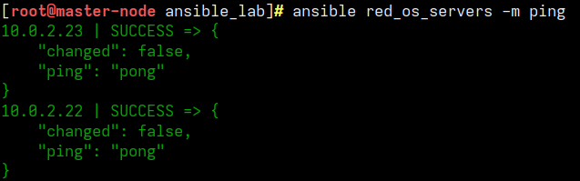
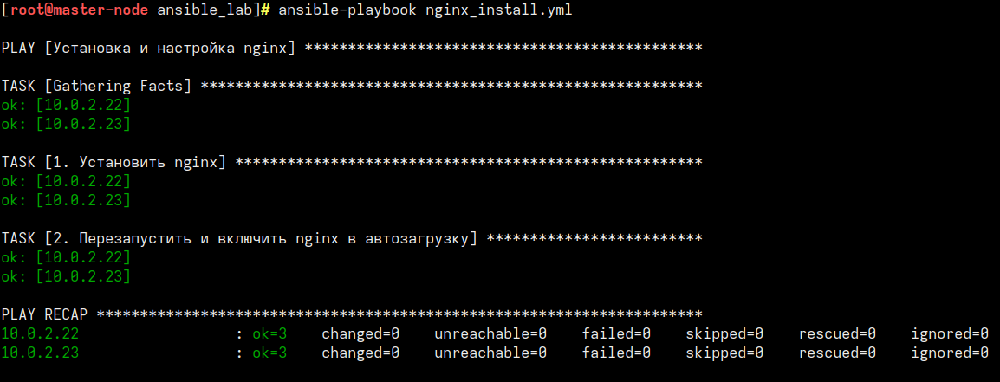

# Моя Ansible-лаба: Ставим Nginx на Ред ОС

Сделал этот проект, чтобы разобраться, как автоматизировать рутину с помощью Ansible. Плейбук просто берет и одной командой накатывает Nginx на чистые сервера, запускает его и вешает в автозагрузку. 

Делал для себя, но решил выложить — вдруг кому-то пригодится как готовый шаблон для старта.

## Как у меня всё устроено в VirtualBox

Я поднял тестовый стенд прямо на компе в VirtualBox. Внутри крутятся 3 виртуалки:
* **Управляющая нода (master-node):** отсюда я пинаю Ansible.
* **Два целевых сервера** на Ред ОС с IP `10.0.2.22` и `10.0.2.23`. 

**По сети:** все машинки сидят в одной подсети (у меня настроен [NAT с пробросом). 
Чтобы Ansible не задавал лишних вопросов, я один раз сгенерировал SSH-ключ на мастере (`ssh-keygen -t ed25519`) и раскидал его по серверам через `ssh-copy-id`. Теперь всё работает без паролей.

## Что внутри проекта

* `hosts` — список моих серверов и юзеры, под которыми Ansible туда ходит.
* `ansible.cfg` — подкрутил настройки, чтобы Ansible не ругался на незнакомые SSH-ключи виртуалок (`host_key_checking = False`).
* `nginx_install.yml` — сам сценарий. Он обновляет кэш пакетов, ставит `nginx` через `dnf` и включает службу.
* `group_vars/red_os_servers.yml` — здесь лежат пути к ключам и указана конкретная версия Python (3.11), которая стоит на виртуалках.

## Как это запускать (памятка для себя)

1. Включаем виртуалки в VirtualBox.
2. Проверяем, что Ansible их видит:
   ```bash
   ansible red_os_servers -m ping```


3. Запускаем установку
### Результат работы плейбука

